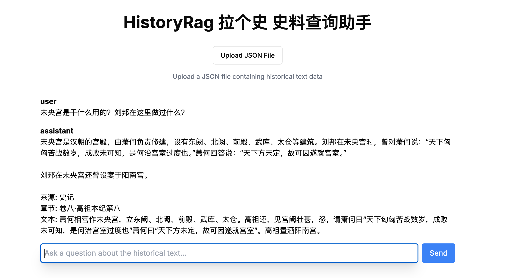

# HistoryRag 拉个史

这是一个人工智能史料查询工具。用户可以本地部署，上传史料，然后问关于史料的问题。

## 本地部署条件
1. 需要有一个本地或者远程PostgreSQL。
2. 需要有一个OpenAI的API key。

## 第一次本地部署
`./install.sh`

安装过程中，请依次输入你的PostgreSQL URL和OpenAI API key

## 本地运行
`pnpm run dev`

## 上传史料要求
格式必须遵循下面的样式：
```json
[
  {
    "source": "史记",
    "chapter": "卷八·高祖本纪第八",
    "text": "高祖，沛丰邑中阳里人，姓刘氏，字季。父曰太公，母曰刘媪。其先刘媪尝息大泽之陂，梦与神遇。是时雷电晦冥，太公往视，则见蛟龙於其上。已而有身，遂产高祖。",
    "chapter_url": "https://duguoxue.com/ershisishi/2567.html",
    "translation": "https://duguoxue.com/ershisishi/2699.html"
  },
  {
    "source": "史记",
    "chapter": "卷八·高祖本纪第八",
    "text": "高祖为人，隆准而龙颜，美须髯，左股有七十二黑子。仁而爱人，喜施，意豁如也。常有大度，不事家人生产作业。及壮，试为吏，为泗水亭长，廷中吏无所不狎侮。好酒及色。常从王媪、武负贳酒，醉卧，武负、王媪见其上常有龙，怪之。高祖每酤留饮，酒雠数倍。及见怪，岁竟，此两家常折券弃责。",
    "chapter_url": "https://duguoxue.com/ershisishi/2567.html",
    "translation": "https://duguoxue.com/ershisishi/2699.html"
  }
]
```

## 示范

我把二十四史都放到了`public/json`这个文件夹下。可以上传任何一个或者全部，请勿重复上传。

先上传史料，传完就可以随便问问题了。



## 测试
`pnpm test`

## 常见问题
### 怎么看数据库的数据？
`pnpm db:studio`

## 本地部署

- [Next.js](https://nextjs.org) 14 (App Router)
- [Vercel AI SDK](https://sdk.vercel.ai/docs)
- [OpenAI](https://openai.com)
- [Drizzle ORM](https://orm.drizzle.team)
- [Postgres](https://www.postgresql.org/) with [ pgvector ](https://github.com/pgvector/pgvector)
- [shadcn-ui](https://ui.shadcn.com) and [TailwindCSS](https://tailwindcss.com) for styling
